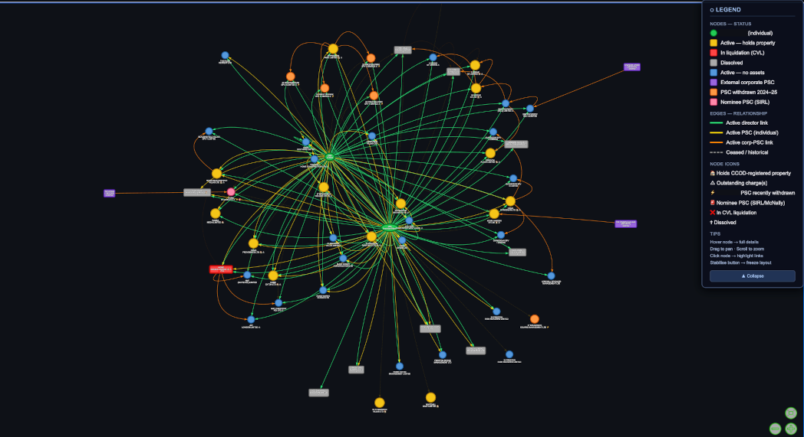

# uk-corporate-tracer

**Map UK company ownership networks and trace property assets using Companies House and Land Registry open data.**

Given one or more target individuals (name + date of birth), this pipeline automatically discovers all UK limited companies they control — directly or through corporate chains — and cross-references them against the Land Registry to produce a structured asset register with property holdings, charges, and ownership tiers.

---



*Interactive network graph — each node is a company, colour-coded by status. Hover for details, drag to explore. Generated by `build_graph.py`.*

---

## Who is this for?

| Use case | How it helps |
|---|---|
| **Debt recovery** | Find all companies and properties held by a debtor before enforcement |
| **Due diligence** | Map the corporate footprint of a director or business partner |
| **Fraud / AML investigation** | Trace complex ownership structures and asset flows |
| **Journalism / research** | Build a verifiable picture of who owns what |
| **Insolvency practitioners** | Identify asset-holding entities in a corporate group |

---

## What it does

1. **Finds all companies** — searches Companies House API for all director appointments, PSC (person with significant control) records, and corporate ownership chains linked to your target individuals
2. **Expands the network** — recursively follows corporate PSC chains using the CH bulk data snapshot (15M+ records, no API rate limits)
3. **Cross-references the Land Registry** — scans CCOD and OCOD to find all properties registered to any discovered company
4. **Reconstructs transaction history** — optionally scans the full Price Paid Data to show what was bought, sold, and for how much
5. **Produces a ranked asset register** — a single CSV with every property, its charges, the directors' ownership stake, and a priority tier (A–F)
6. **Generates an interactive network graph** — visual HTML map of the company network with drill-down tooltips
7. **Generates a PDF intelligence summary** — professionally formatted report ready for legal use

---

## Pipeline overview

```
config.py
  └─ DIRECTORS (name, DOB)
       │
       ▼
Step 1  CH API      → director appointments
Step 2  CH API      → company details, PSC, officers
Step 2b Bulk DB     → downward PSC ownership chain (gen 1→2→3)
Step 4  Bulk DB     → all companies where target is PSC (name+DOB matched)
Step 2  CH API      → incremental details for bulk-found companies
Step 3  CH API      → charges register
Step 5  Local files → CCOD/OCOD Land Registry scan → properties
        ↓
  asset_discovery.db
        ↓
  report.py          → output/asset_register_[ts].csv
  build_graph.py     → output/corporate_network.html
  generate_report.py → output/asset_intelligence_summary.pdf
```

---

## Prerequisites

- Python 3.9+
- A free [Companies House API key](https://developer.company-information.service.gov.uk/)
- Land Registry bulk datasets — see [Data Setup](#data-setup) below
- CH Bulk Data — see [Data Setup](#data-setup) below

---

## Installation

```bash
git clone https://github.com/YOUR_USERNAME/uk-corporate-tracer.git
cd uk-corporate-tracer
pip install -r requirements.txt
```

**Dependencies:** `requests`, `pyvis`, `reportlab`

---

## Configuration

```bash
cp config.example.py config.py
```

Edit `config.py`:

```python
CH_API_KEY = "your-api-key-here"

path = "/path/to/your/land-registry-data/"
CCOD_PATH   = path + "CCOD_FULL_YYYY_MM.csv"
OCOD_PATH   = path + "OCOD_FULL_YYYY_MM.csv"

DIRECTORS = [
    {
        "name":      "SMITH, John William",
        "aliases":   ["John William Smith", "John Smith"],
        "dob_year":  1970,
        "dob_month": 4,
    },
]
```

> **Never commit `config.py`** — it's in `.gitignore` by default.

---

## Data Setup

All datasets used by this pipeline are **free and publicly available**. They must be downloaded manually — there is no API for bulk access to the Land Registry ownership data.

### Companies House Bulk Data

| File | Size | Description |
|---|---|---|
| `BasicCompanyDataAsOneFile-YYYY-MM-DD.csv` | ~750MB | Full company register |
| `persons-with-significant-control-snapshot-YYYY-MM-DD.txt` | ~12GB | All PSC records (JSON lines) |

Download from: **https://download.companieshouse.gov.uk/en_output.html**

Updated monthly. After downloading, run once to build the local database:

```bash
python load_ch_bulk.py   # ~15 mins
```

### Land Registry — CCOD and OCOD

| File | Size | Update frequency | What it contains |
|---|---|---|---|
| `CCOD_FULL_YYYY_MM.csv` | ~200MB | Monthly | All UK property owned by UK companies (current state) |
| `OCOD_FULL_YYYY_MM.csv` | ~50MB | Monthly | All UK property owned by overseas companies |

Download from: **https://use-land-property-data.service.gov.uk/datasets/ccod**

> These are **current-state snapshots** — a property that has been sold will no longer appear. There is no historical version and no API equivalent. These files are required for the main pipeline to work.

### Land Registry — Price Paid Data *(optional)*

| File | Size | What it contains |
|---|---|---|
| `pp-complete.txt` | ~4.7GB | Every UK property transaction since 1995 |

Download from: **https://www.gov.uk/government/statistical-data-sets/price-paid-data-downloads**

> PPD does **not** contain buyer or seller names — matching is by postcode and house number only. It is used by `ppd_scan.py` to reconstruct transaction history for properties found in CCOD. It is not required for the main `run.py` pipeline.

A SPARQL endpoint exists (`http://landregistry.data.gov.uk/app/ppd/`) for individual address lookups, but for scanning an entire company network the local file is significantly faster.

### Individual title searches *(manual, paid)*

For confirming the current registered proprietor of a specific property — especially personally held assets not captured by CCOD — use the Land Registry title search:

**https://www.gov.uk/search-property-information-land-registry** — £7 per title register, instant.

---

## Usage

```bash
# First time only — build local bulk database (~15 mins)
python load_ch_bulk.py

# Full pipeline (CH API + bulk expansion + Land Registry scan)
python run.py --all

# Skip Land Registry scan (faster, API only)
python run.py

# Rebuild CSV report from existing database (no API calls)
python run.py --report

# Run a single step
python run.py --step 1    # director appointments only
python run.py --step bulk # bulk PSC expansion only

# Show database summary
python run.py --summary

# Generate interactive network graph
python build_graph.py

# Generate PDF intelligence summary
python generate_report.py

# Scan Price Paid Data for transaction history (requires pp-complete.txt)
python ppd_scan.py
```

---

## Output

### Asset Register CSV (`output/asset_register_*.csv`)

One row per director × property relationship. Key columns:

| Column | Description |
|---|---|
| **Priority** | Enforcement priority score |
| **Tier** | A=unencumbered, B=1 charge, C=2, D=3, E=4+, F=leasehold/inactive |
| **Property Address** | Full address from Land Registry |
| **Company** | Registered proprietor company |
| **[D1] Active / PSC** | Director's current status in this company |
| **Min. Combined Ownership** | Directors' minimum share (100% minus max third-party PSC) |
| **Outstanding Charges** | Number of outstanding charges |
| **Charge Holders** | Lender names |
| **Dataset Source** | CCOD / OCOD |

### Network Graph (`output/corporate_network.html`)

Interactive force-directed graph. Open in any browser — no server required.

- **Nodes:** companies (colour = status) and target individuals
- **Edges:** director links, PSC links, corporate PSC ownership chains
- **Hover** any node for company details, property holdings, and charge summary
- **Colour coding:** gold = holds property · red = liquidation · grey = dissolved · blue = active

### PDF Report (`output/asset_intelligence_summary.pdf`)

Formatted intelligence summary including: property register, transaction history, charge register, key findings, and recommended actions.

---

## Optional enrichment APIs

The core pipeline uses only Companies House and Land Registry data. The following free APIs can supplement findings with additional property intelligence:

### EPC Register (Energy Performance Certificates)

**https://epc.opendatacommunities.org/** — free, requires registration

Returns for each property:
- Floor area (m²) — useful for valuation cross-checks
- Construction date band
- Energy rating (A–G)
- Property type and tenure

```python
# Example: lookup by postcode
GET https://epc.opendatacommunities.org/api/v1/domestic/search?postcode=SW1A+1AA
# Header: Authorization: Basic <base64(email:api_key)>
```

The EPC register covers most properties that have been sold or rented since 2008. Not all properties will have a certificate.

### Companies House API — additional endpoints

Beyond what the pipeline already uses, the CH API also exposes:

| Endpoint | What it gives you |
|---|---|
| `/company/{cn}/filing-history` | Confirmation statements, accounts, charge filings |
| `/company/{cn}/insolvency` | Insolvency case details, practitioners |
| `/company/{cn}/registers` | Where statutory registers are held |

All free, same API key.

---

## Limitations

- **CCOD is current-state only** — properties already sold do not appear. Use `ppd_scan.py` to reconstruct transaction history.
- **PPD contains no names** — matching is by postcode + house number. Verify matches with a £7 Land Registry title search.
- **"Outstanding" charges ≠ live debt** — lenders frequently fail to file satisfaction forms after repayment.
- **Personally held property is not captured** — CCOD records company-owned property only. Use individual LR title searches for personal holdings.
- **CH bulk data has a snapshot date** — very recent changes may not be reflected until the next monthly download.
- **EPC coverage is incomplete** — properties that have never been sold or rented since 2008 will not have a certificate.

---

## Legal disclaimer

This tool queries publicly available government registers. All data is sourced from Companies House and HM Land Registry open datasets. Users are responsible for ensuring their use complies with applicable law, including data protection obligations. This tool does not constitute legal advice.

---

## Contributing

See [CONTRIBUTING.md](CONTRIBUTING.md).

## License

MIT — see [LICENSE](LICENSE).
